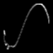
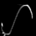
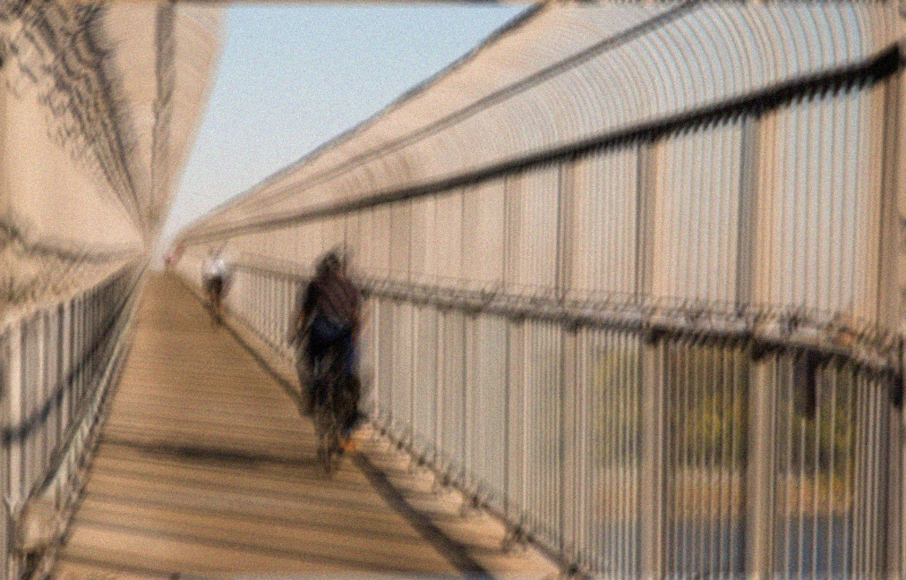
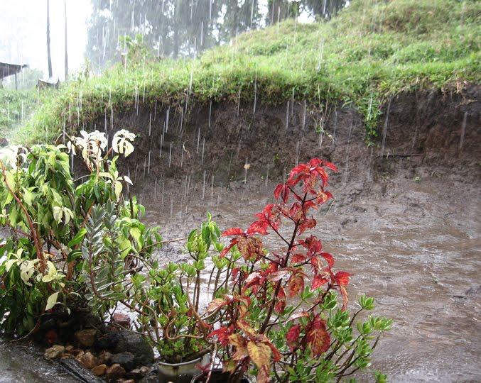
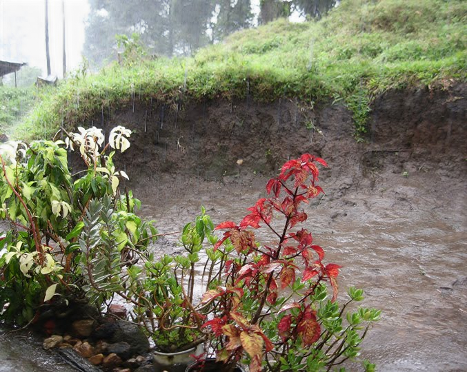

# FIMA
### On the Convergence of Learning-based Iterative Methods for Nonconvex Inverse Problems (TPAMI 2019) ###
If you find this code is useful, please cite our paper:

% @article{liu2019convergence, 
%   title={On the convergence of learning-based iterative methods for nonconvex inverse problems}, 
%   author={Liu, Risheng and Cheng, Shichao and He, Yi and Fan, Xin and Lin, Zhouchen and Luo, Zhongxuan}, 
%   journal={IEEE transactions on pattern analysis and machine intelligence}, 
%   year={2019}, 
%   publisher={IEEE} 
% } 

### Dependency ###
### <a href  = "https://github.com/vlfeat/matconvnet"> Matconvnet-1.0-beta24</a> ###

We provide a compiled version of Matconvnet-1.0-beta24 <a href = "#">here</a> in Windows10, CUDA9.0, GTX TITAN X, but in most cases, you need to recompile it in you own machine with vl_compilenn() function.

### Usage ###
Make sure your Matconvnet is compiled and its reference path is set correctly.

Simplely run Blind_Deblur.m, Nonblind_Deblur.m or Derain.m in Matlab, you can see the results shown below. It's quite easy!

### Blind Deblur ###

||
|
|:----------:|:-------------:|
|  **Input**  | **Output** |

||
|
|:----------:|:-------------:|
|  **GT Kernel: size = 75**  | **Our Estimated Kernel** |

### Nonblind Deblur ###
||
|
|:----------:|:-------------:|
|  **Input**  | **Output** |

### Derain ###
||
|
|:----------:|:-------------:|
|  **Input**  | **Output** |

||
|
|:----------:|:-------------:|
|  **Input**  | **Output** | 
