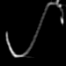

# FIMA
On the Convergence of Learning-based Iterative Methods for Nonconvex Inverse Problems (TPAMI 2019)

### Dependency ###
#### <a href  = "https://github.com/vlfeat/matconvnet"> Matconvnet-1.0-beta24</a> ####

We produce a complied version of Matconvnet-1.0-beta24 in Windows10, CUDA9.0, GTX TITAN X, but in most cases, you need to recomplie in you own machine.

### Blind Deblur ###

 |

：-：|：-：
Input | Ouput

### Nonblind Deblur ###

Input  &ensp;&ensp;&ensp;&ensp;&ensp;      Ouput

### Derain ###

Input  &ensp;&ensp;&ensp;&ensp;&ensp;&ensp;&ensp;         Ouput

Input   &ensp;&ensp;&ensp;&ensp;&ensp;&ensp;&ensp;         Ouput
